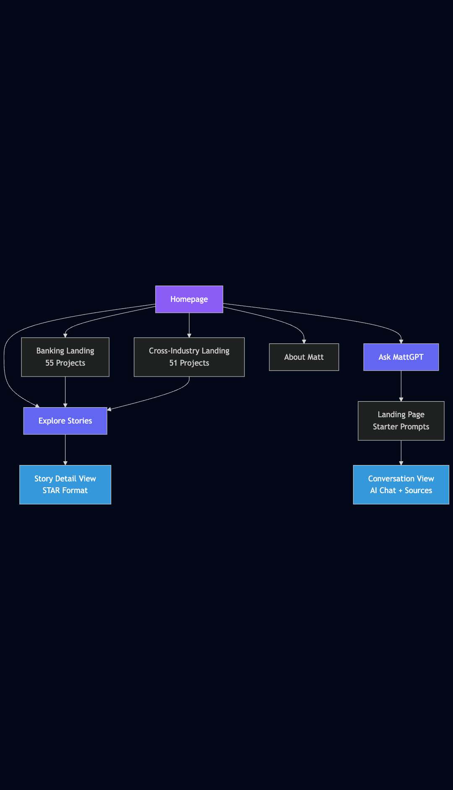
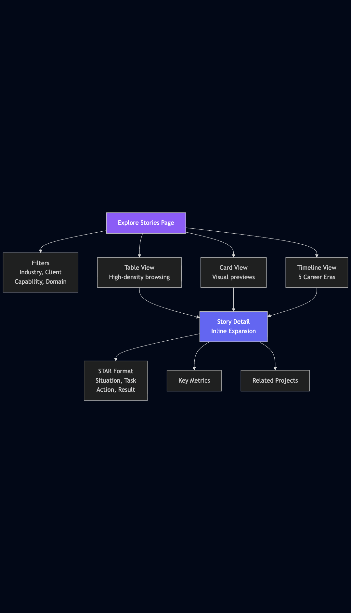
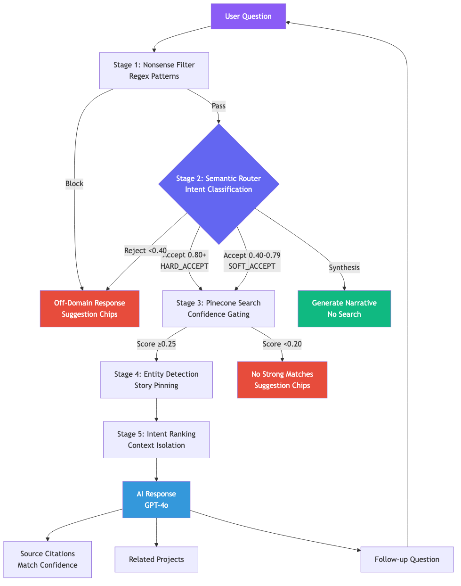

# Technical Architecture

**MattGPT: From Streamlit MVP to React Rebuild**

> This document outlines the technical architecture evolution of MattGPT, demonstrating intentional trade-off awareness and strategic planning from rapid prototyping to production polish.

---

## Architecture Roadmap Overview

MattGPT's architecture follows a two-phase evolution:

1. **Phase 1 (Streamlit MVP):** Validate RAG architecture with minimal investment
2. **Phase 2 (React Rebuild):** Better performance and maintainability

---

## Phase 1: MVP - Rapid Validation

**Status:** ✅ Complete (December 2025)
**Timeline:** Current State
**Primary Goal:** Validate product-market fit with minimal investment

### Tech Stack

| Component | Technology | Purpose |
|-----------|-----------|---------|
| 🐍 **Frontend/Backend** | Streamlit (Monolith) | Rapid prototyping framework |
| 🤖 **LLM** | OpenAI GPT-4 | Natural language processing |
| 🌲 **Vector Database** | Pinecone | Semantic search and embeddings |
| 📦 **Dependencies** | Python venv + pip | Local development environment |

### Accepted Trade-offs

The MVP phase consciously accepted limitations to accelerate learning:

- **Mobile-responsive implementation:** Production-quality mobile CSS with breakpoints at 767px (mobile), 768-1024px (tablet), 1024+ (desktop)
- **Limited scalability:** Estimated ~100 concurrent users (not load-tested; Streamlit Community Cloud limits apply)
- **No caching layer:** Direct database queries
- **Modular architecture:** Refactored from monolithic app.py to component-based structure
- **Minimal observability:** Basic logging only

### Key Decisions

**Why Streamlit?**
- ✅ Initial MVP build time: 2 weeks vs 3+ months for React*
- ✅ Python-native (matches ML/AI ecosystem)
- ✅ Built-in state management
- ✅ Rapid iteration without frontend complexity

*Note: Continuous refinement and feature additions ongoing since launch.

**What We Validated:**
- RAG architecture effectiveness
- System prompt design
- STAR methodology implementation
- User experience patterns
- Search relevance tuning

### Architecture Evolutions Achieved

**January 2026 - RAG Pipeline Cleanup:**
- ✅ 5-stage RAG pipeline with 98.1% eval pass rate (60/61)
- ❌ Removed Entity Gate bouncer (was blocking legitimate queries)
- ❌ Removed `classify_query_intent()` LLM call (redundant with router)
- ✅ Semantic router now handles synthesis + out-of-scope + narrative detection
- ✅ Expanded to 14 intent families (was 10)
- ✅ Centralized thresholds in `config/constants.py`
- ✅ Unified SEARCH_TOP_K = 10 (was 100/7 conflict)
- ✅ Title soft filtering (semantic search ranks naturally)
- ✅ Model upgrade: GPT-4o-mini → GPT-4o

**December 2025 - Modular Architecture:**
- Refactored monolithic ask_mattgpt.py (4,696 lines) into 9-file directory
- Separated concerns: backend_service.py, conversation_view.py, conversation_helpers.py
- Reusable component library (ui/components/)

**Design System:**
- CSS variables for light/dark mode support (global_styles.py:28-122)
- Standardized breakpoints: 767px (mobile), 768-1024px (tablet), 1024+ (desktop)
- Consistent purple brand (#8B5CF6) across all views

**Timeline View Innovation:**
- Era-based project grouping (timeline_view.py)
- 5 career eras with date range calculation
- Progressive disclosure pattern (6 most recent per era)

**Mobile Implementation:**
- 200 lines of responsive CSS (global_styles.py:399-596)
- Touch-optimized controls and stacking layouts
- Horizontal scroll tables with preserved functionality

---

## 5-Stage RAG Pipeline

**Status:** ✅ Implemented (January 2026)
**Quality:** 98.1% eval pass rate (60/61 queries)

MattGPT uses a **5-stage RAG (Retrieval-Augmented Generation) pipeline** to ensure accurate, grounded responses:

### Pipeline Overview

```
Query → Stage 1 → Stage 2 → Stage 3 → Stage 4 → Stage 5 → LLM Response
```

**Stage 1: Rules-Based Nonsense Detection**
- Fast regex matching against `nonsense_filters.jsonl` patterns
- Catches obvious off-domain queries (weather, sports, stocks, etc.)
- Zero embedding cost, executes in <5ms
- Blocks 60%+ of nonsense before semantic processing

**Stage 2: Semantic Router (Intent + Out-of-Scope Detection)**
- Embedding-based similarity matching against 14 intent families
- Dual-threshold system: HARD_ACCEPT (0.80), SOFT_ACCEPT (0.40)
- Detects synthesis queries (no Pinecone search needed)
- Flags out-of-scope industries gracefully
- **Replaced:** Legacy LLM intent classification (removed Jan 2026)

**Stage 3: Confidence Gating**
- Pinecone semantic search with confidence scoring
- Thresholds: HIGH (0.25), LOW (0.20)
- Filters phantom similarity noise
- Returns 0 results below minimum threshold

**Stage 4: Entity Detection & Pinning**
- Detects: Client, Employer, Division, Title
- Hard filters: Client, Employer, Division, Project, Place
- Soft filters: Title (semantic search ranks naturally)
- **Removed:** Entity Gate threshold bouncer (was blocking valid queries)

**Stage 5: Intent-Aware Ranking**
- Narrative queries: Trust Pinecone semantic ranking
- Entity queries: Pin matching story to #1
- Context isolation via XML tags prevents cross-story bleed
- Multi-field entity search across 6 fields

---

## Query Validation & Nonsense Detection

**Purpose:** Prevent off-domain queries and ensure Agy only answers questions grounded in Matt's portfolio

### Architecture Overview

MattGPT uses a **two-layer defense** (Stages 1-2 of the RAG pipeline):

**Layer 1: Pattern-Based Filters** (Stage 1)
- Fast regex patterns for common off-domain categories
- Catches edge cases before semantic routing
- Zero-shot detection without embedding costs

**Layer 2: Semantic Router** (Stage 2)
- Embedding-based similarity matching against canonical intent examples
- Dual-threshold system for confident classification
- Handles intent classification, synthesis detection, and out-of-scope flagging
- Returns best matching intent family for telemetry and debugging

**Implementation Files:**
- `nonsense_filters.jsonl` - Regex pattern definitions
- `services/semantic_router.py` - Intent classification logic
- `data/intent_embeddings.json` - Cached embeddings for intent families

---

### Semantic Router: Dual-Threshold Intent Classification

**How It Works:**

1. User submits query
2. Query is embedded using OpenAI text-embedding-3-small
3. Cosine similarity computed against canonical intent examples
4. Query classified based on similarity threshold

**Thresholds (Updated January 2026):**

```python
HARD_ACCEPT = 0.80  # Clearly on-topic, no question
SOFT_ACCEPT = 0.40  # Accept but log as borderline for review (lowered from 0.72)
# Below 0.40 = router rejects (search fallback may still attempt)
```

**What Changed (January 2026):**
- ❌ **Removed:** Entity Gate threshold bouncer (was blocking legitimate narrative queries)
- ❌ **Removed:** `classify_query_intent()` LLM call (GPT-4o-mini - redundant with router)
- ✅ **Added:** Synthesis detection (intent_family == "synthesis")
- ✅ **Added:** Out-of-scope industry detection (intent_family == "out_of_scope")
- ✅ **Added:** Narrative queries (intent_family == "narrative")
- ✅ **Expanded:** 10 intent families → 14 intent families

**Intent Families (14 categories):**

| Family | Example Queries |
|--------|----------------|
| **background** | "Tell me about Matt's career", "Who is Matt Pugmire?" |
| **behavioral** | "Tell me about a time Matt failed", "How do you handle conflict?" |
| **delivery** | "How did Matt achieve 4x faster delivery?", "Show me delivery wins" |
| **team_scaling** | "How did Matt scale teams from 4 to 150+?" |
| **leadership** | "What's Matt's leadership style?", "How does Matt coach people?" |
| **technical** | "Show me Matt's platform engineering work", "Cloud modernization?" |
| **domain_payments** | "Show me payments modernization work", "Experience in banking?" |
| **domain_healthcare** | "Show me healthcare projects", "Life sciences experience?" |
| **stakeholders** | "How does Matt handle difficult stakeholders?" |
| **innovation** | "Tell me about the innovation center work" |
| **agile_transformation** | "Tell me about agile transformation", "Scaling agile delivery" |
| **narrative** | "What's Matt's professional identity?", "Builder vs maintainer?" |
| **synthesis** | "What's Matt's professional narrative?", "Summarize Matt's career themes" |
| **out_of_scope** | Industry queries outside Matt's domain (graceful redirect) |

**Example Classification:**

```python
# HARD_ACCEPT (score 0.85, above 0.80 threshold)
"How did Matt scale agile at JPMorgan?" → intent_family: "delivery"

# SOFT_ACCEPT (score 0.74, above 0.40 threshold)
"What's Matt's approach to team growth?" → intent_family: "team_scaling"
# Logged for review, but accepted

# REJECTED (score 0.35, below 0.40 threshold)
"What's the weather in New York?" → intent_family: None
# Triggers off-domain response
```

---

### RAG Pipeline Thresholds & Constants

All thresholds are centralized in `config/constants.py` (single source of truth):

**Semantic Router Thresholds:**
```python
HARD_ACCEPT = 0.80   # Clearly on-topic, no question
SOFT_ACCEPT = 0.40   # Accept but log as borderline for review
```

**RAG Confidence Thresholds:**
```python
CONFIDENCE_HIGH = 0.25  # Strong match - show "Found X stories"
CONFIDENCE_LOW = 0.20   # Raised from 0.15 to filter phantom similarity noise
```

**Pinecone Search Parameters:**
```python
PINECONE_MIN_SIM = 0.15   # Minimum similarity for Pinecone results
SEARCH_TOP_K = 10         # Stories to fetch (headroom for reranking/filtering)
                          # Centralized Jan 2026 - was 100/7 conflict
```

**Entity Detection:**
```python
ENTITY_GATE_THRESHOLD = 0.30  # Semantic scoring threshold (lowered from 0.55)
                               # Note: Entity Gate as bouncer removed Jan 2026
```

**Model Configuration:**
```python
DEFAULT_CHAT_MODEL = "gpt-4o"              # Primary LLM (upgraded from gpt-4o-mini)
DEFAULT_EMBEDDING_MODEL = "text-embedding-3-small"  # 1536 dimensions
SEARCH_TOP_K = 10                          # Was 100 (explore) / 7 (ask) - now unified
```

---

### Pattern-Based Filters: Regex Nonsense Detection

**How It Works:**

Fast regex matching against `nonsense_filters.jsonl` patterns to catch obvious off-domain queries.

**Filter Categories (10+):**

| Category | Pattern Examples | Sample Rejected Queries |
|----------|-----------------|------------------------|
| **weather** | `\b(weather|forecast|temperature|rain|snow)\b` | "What's the weather today?" |
| **sports** | `\b(NBA|NFL|Yankees|score|odds|betting)\b` | "Who won the Super Bowl?" |
| **stocks_crypto** | `\b(stock|NASDAQ|BTC|crypto|price chart)\b` | "What's Bitcoin's price?" |
| **personal_sensitive** | `\b(SSN|social security|passport|credit card)\b` | "What's Matt's social security number?" |
| **retail_price** | `\b(how much|price|cost)\\b.*\\b(walmart|amazon)\b` | "How much does this cost at Walmart?" |
| **shopping_merch** | `\b(hat|shirt|hoodie)\\b.*\\b(buy|purchase)\b` | "Where can I buy a hat?" |
| **random_fun** | `\b(lottery|horoscope|zodiac|pick-up line)\b` | "What's my horoscope?" |
| **personal_trivia** | `favorite (color|food|movie|song)` | "What's Matt's favorite color?" |
| **creative_writing** | `\b(write|compose)\\b.*(poem|story|haiku)\b` | "Write me a poem" |
| **general_knowledge** | `\b(capital of|president of|who is the)\b` | "Who is the president of France?" |

**Performance:**
- Pattern matching is O(n) where n = number of patterns (~20)
- Executes in <5ms before semantic routing
- Zero embedding cost for obvious nonsense

---

### UX Flow for Off-Domain Queries

**When a query is rejected:**

1. **Semantic router** flags query as below 0.40 threshold
2. **Pattern filter** (optional) confirms off-domain category
3. **Agy responds** with helpful redirect:

**Example Response:**

```
🐾 I'm not finding matches for that in Matt's portfolio.

I'm focused on Matt's 20 years of digital transformation
experience—things like agile delivery, platform engineering,
team scaling, and stakeholder management.

Try asking about:
• "How did Matt scale teams at JPMorgan?"
• "Show me Matt's platform engineering work"
• "What's Matt's approach to innovation leadership?"

What would you like to know about Matt's experience?
```

**Suggestion Chips Displayed:**
- "Show me agile transformation projects"
- "Tell me about Matt's leadership style"
- "How did Matt scale engineering teams?"

---

### Accepted vs. Rejected Query Examples

**✅ ACCEPTED Queries:**

| Query | Why Accepted | Intent Family |
|-------|-------------|---------------|
| "How do you scale agile?" | 0.87 similarity to "team_scaling" family | team_scaling |
| "Tell me about Matt's biggest failure" | 0.82 similarity to "behavioral" family | behavioral |
| "Show me banking projects" | 0.91 similarity to "domain_payments" family | domain_payments |
| "What's Matt's technical background?" | 0.85 similarity to "technical" family | technical |
| "How does Matt handle difficult stakeholders?" | 0.89 similarity to "stakeholders" family | stakeholders |

**❌ REJECTED Queries:**

| Query | Why Rejected | Detection Method |
|-------|-------------|------------------|
| "What's the weather in New York?" | 0.32 similarity + weather pattern match | Semantic + Pattern |
| "Who won the Super Bowl?" | 0.28 similarity + sports pattern match | Semantic + Pattern |
| "What's Bitcoin's price?" | 0.19 similarity + crypto pattern match | Semantic + Pattern |
| "Write me a poem about leadership" | 0.41 similarity + creative_writing pattern | Semantic + Pattern |
| "What's Matt's favorite color?" | 0.35 similarity + personal_trivia pattern | Semantic + Pattern |

**Borderline Cases (0.40-0.80):**

| Query | Similarity | Action |
|-------|-----------|--------|
| "What's Matt's management philosophy?" | 0.74 | Accepted (soft), logged for review |
| "How does someone become a platform engineer?" | 0.58 | Accepted (soft), may redirect to Matt's experience |
| "Tell me about product-market fit" | 0.35 | Rejected, suggest Matt's product innovation work |

---

### Why This Approach Works

**Prevents Poor User Experience:**
- No wasted searches on irrelevant queries
- No confusing "here's what I found" with zero results
- Immediate feedback with helpful suggestions

**Maintains Credibility:**
- Agy never pretends to know things outside Matt's domain
- Clear boundaries reinforce "proof, not promises" positioning
- Honest limitations build trust

**Reduces Costs:**
- Pattern filters catch 60%+ of nonsense before embedding
- Semantic router catches another 35% before RAG pipeline
- Only ~5% of queries reach expensive LLM generation unnecessarily

**Enables Learning:**
- Soft accept threshold (0.40-0.80) logs borderline queries
- Manual review improves intent family coverage over time
- Telemetry shows what users are actually asking

---

### Future Enhancements (Phase 2)

**Planned improvements for React migration:**

- **Dynamic intent expansion:** Use LLM to generate new canonical examples from accepted queries
- **User feedback loop:** "Was this answer helpful?" → retrain router
- **Intent routing:** Different response templates per intent family
- **A/B testing:** Experiment with threshold values (e.g., 0.40 vs 0.45 for soft accept)
- **Analytics dashboard:** Visualize rejection reasons, borderline cases, intent distribution

**Phase 2 migration note:** The semantic router logic is framework-agnostic and will port directly to React/FastAPI architecture.

---

## Phase 2: React Rebuild

**Status:** 🎯 Planned (Q1 2026)
**Purpose:** Better performance and maintainability

The Streamlit MVP validated the RAG architecture and UX patterns. React will make it production-quality with modern tooling and mobile-first design.

### Tech Stack

| Component | Technology | Purpose |
|-----------|-----------|---------|
| ⚛️ **Frontend** | React + Next.js | Modern, performant UI framework |
| 🚀 **Backend** | FastAPI | High-performance async API |
| 🔍 **RAG Pipeline** | Same as Phase 1 | Proven architecture, no changes needed |

### What Changes

- **UI Framework:** Streamlit → React (better performance, component reusability)
- **API Layer:** Monolithic app.py → FastAPI microservices
- **Mobile:** Responsive CSS → Mobile-first from the start

### What Stays the Same

- Semantic search with confidence scoring
- Semantic router and nonsense detection
- STAR data model and 5P taxonomy
- Pinecone vector database
- OpenAI embeddings and LLM

**Why React?** Modern component architecture, better mobile experience, easier to maintain long-term.

---

## Strategic Rationale

### 1. De-Risk with MVP-First Thinking

**Decision:** Start with Streamlit monolith instead of production-ready stack

**Rationale:**
- Validated RAG architecture effectiveness before infrastructure investment
- Tested system prompt design with real users
- Refined user experience patterns
- Minimized wasted effort on premature optimization

**Result:** 2-week build time vs 3+ months for React-based solution

---

### 2. Preserve Core IP Across Phases

**Decision:** Keep data pipeline architecture unchanged across all phases

**What Stays Constant:**
- Embedding generation process
- Pinecone indexing strategy
- STAR taxonomy and metadata
- Search relevance algorithms

**What Evolves:**
- Presentation layer (Streamlit → React)
- API architecture (monolith → microservices)
- Infrastructure (local → cloud)

**Benefit:** Minimizes technical debt and preserves investment in core IP

---

### 3. Demonstrate Trade-Off Awareness

**MVP Limitations Were Intentional Shortcuts:**

| Limitation | Business Justification |
|-----------|----------------------|
| Desktop-only | Target users (recruiters, hiring managers) primarily use desktop |
| 100-user limit | Portfolio showcase doesn't require scale |
| Monolithic architecture | Faster development, simpler deployment |
| No caching | Query latency acceptable for MVP validation |

**vs. Accidental Technical Debt:**
- Not "ran out of time to implement mobile"
- Not "didn't know how to scale"
- **Consciously traded features for speed**

---

### 4. Align Architecture to Business Goals

**Phase 1: Portfolio Showcase (Current)**
- **Purpose:** Demonstrate technical capability to employers
- **Stack:** Streamlit monolith - fast to build, sufficient for use case
- **Result:** Validated RAG architecture and UX in 2 weeks vs 3+ months

**Phase 2: Production Polish (Q1 2026)**
- **Purpose:** Better performance and maintainability
- **Stack:** React + FastAPI - modern tooling, mobile-first
- **Benefit:** Preserve core IP (RAG pipeline), improve presentation layer

**Principle:** Start simple, evolve intentionally

---

## Current State Summary

### What's Live Today (Phase 1 - January 2026)

- ✅ Production Streamlit application at [askmattgpt.streamlit.app](https://askmattgpt.streamlit.app)
- ✅ **5-stage RAG pipeline** with 98.1% eval pass rate (60/61)
- ✅ **GPT-4o** primary LLM (upgraded from GPT-4o-mini)
- ✅ **Semantic router** with 14 intent families + out-of-scope detection
- ✅ 130+ STAR-structured project stories
- ✅ Semantic search with confidence scoring and metadata filtering
- ✅ **Timeline View** with Era-based career progression
- ✅ **Mobile-responsive design** (breakpoints: 767px, 1024px)
- ✅ **Dark mode support** via CSS variables
- ✅ **Modular architecture** (9-file ask_mattgpt/ structure)
- ✅ Conversation history and context management
- ✅ Related Projects UX pattern

### What's Next (Phase 2 - Q1 2026)

- 🎯 React + Next.js frontend rebuild
- 🎯 FastAPI backend
- 🎯 Mobile-first design from the start
- 🎯 Same RAG pipeline, better UI

---

## Technical Diagrams

### Site Navigation Flow



### Explore Stories Views



### Ask MattGPT Flow



### Additional Resources

- [RAG Architecture Diagram](../images/architecture/tech_rag_architecture.png) - Complete RAG lifecycle
- [Site Architecture](../images/architecture/site_architecture_updated.md) - Page hierarchy and navigation (December 2025)
- [Interactive Wireframes](../wireframes/) - Complete UI/UX wireframe set
- [Architecture Evolution Slide](../wireframes/architecture_evolution_slide_wireframe.html) - Visual roadmap timeline

---

## Key Takeaways

1. **MVP-first approach** validated RAG architecture in weeks instead of months
2. **Core IP preservation** - RAG pipeline remains unchanged, only UI evolves
3. **Conscious trade-offs** - Streamlit limitations were intentional, not accidental
4. **Honest roadmap** - Phase 2 React rebuild for better UX, not fantasy enterprise features

---

**Related Documentation:**
- [Product Vision](/mattgpt-design-spec/docs/01-product-vision) - Strategic positioning
- [UX Design Process](/mattgpt-design-spec/docs/03-ux-design-process) - Design decisions
- [Building MattGPT](/mattgpt-design-spec/docs/04-building-mattgpt) - Development journey

---

*Last Updated: January 30, 2026 (RAG Pipeline Update)*
*Version: 1.2 (5-Stage Pipeline, Thresholds, Entity Gate Removal)*
